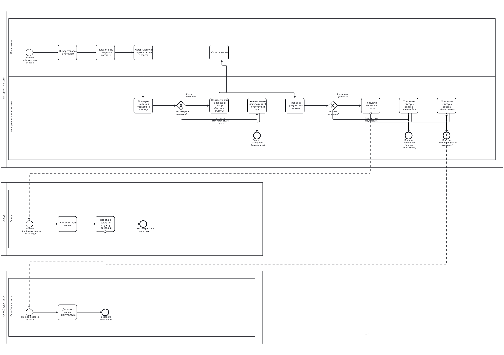

# Online Store Analytics

## Описание проекта

**Online Store Analytics** — учебный проект, моделирующий информационную систему интернет-магазина.

Проект демонстрирует полный цикл работы системного аналитика: анализ требований, проектирование базы данных, моделирование бизнес-процессов, разработку технической документации, написание аналитических SQL-запросов и тестирование REST API.

---

## Цели проекта

- разработать структуру реляционной базы данных интернет-магазина;
- спроектировать ER-диаграмму;
- описать структуру данных;
- подготовить бизнес-требования;
- разработать пользовательскую документацию;
- реализовать аналитические SQL-запросы;
- протестировать REST API с помощью Postman.

---

## Технологии

- MS SQL Server
- SQL - Postman
- REST API
- JSON
- Git - GitHub

---

## Структура базы данных
База данных включает следующие сущности:

- Categories
- Products
- Customers
- Orders
- OrderItems
- Payments
- Deliveries

### ER-диаграмма


---

## Бизнес-процесс

Процесс оформления заказа описан с использованием BPMN.



---

## SQL

В проекте реализовано **20 аналитических SQL-запросов**, включая:

- JOIN
- LEFT JOIN
- GROUP BY
- HAVING
- Common Table Expressions (CTE)
- CASE
- оконные функции (ROW_NUMBER, DENSE_RANK, SUM OVER)
- агрегатные функции
- анализ продаж
- анализ покупателей
- анализ категорий товаров
- анализ выручки

Файл:

```text
sql/analytics_queries.sql
```

---

## REST API тестирование

Для демонстрации работы с REST API использован публичный сервис **Fake Store API**.

Выполнено тестирование основных CRUD-операций:

- GET
- POST
- PUT
- DELETE

Документация:

```text
docs/API_Documentation.md
```

Коллекция Postman:

```text
api/postman_collection.json
```

---

## Документация

Проект содержит следующую документацию:

- Business Requirements
- User Cases
- API Documentation
- Functional Requirements
- Non-functional Requirements

---

## Project Structure

```text
OnlineStoreAnalytics
│
├── api
│   └── postman_collection.json
│
├── database
│   ├── OnlineStore.sql
│   └── database_diagram.png
│
├── docs
│   ├── API_Documentation.md
│   ├── Business_Requirements.md
│   ├── Use Cases.docx
│   ├── Functional Requirements.docx
│   ├── Non-functional Requirement.docx
│   └── images
│
├── sql
│   └── analytics_queries.sql
│
└── README.md
```

---

## Как запустить проект

1. Создать базу данных в MS SQL Server.
2. Выполнить `OnlineStore.sql`.
3. Запустить `analytics_queries.sql`.
4. При необходимости импортировать коллекцию Postman.
5. Ознакомиться с документацией проекта.

---

## Repository Contents

- SQL database
- Analytical SQL queries
- ER Diagram
- BPMN Diagram
- Business Requirements
- Functional Requirements
- Non-functional Requirement
- User Cases
- REST API Documentation
- Postman Collection

---

## Author

Проект выполнен в рамках формирования портфолио по направлению Системная Аналитика.

GitHub:
https://github.com/tiltarisha
