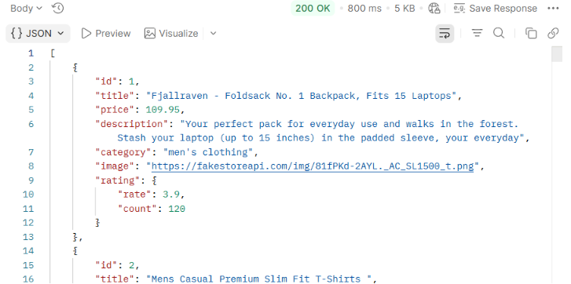
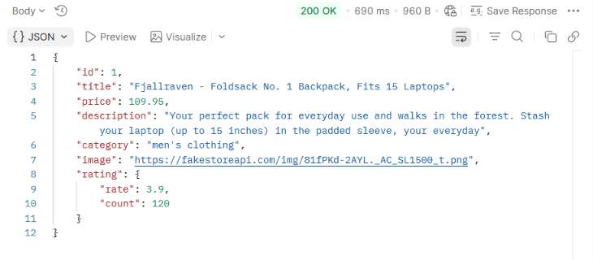
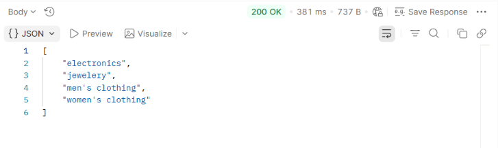
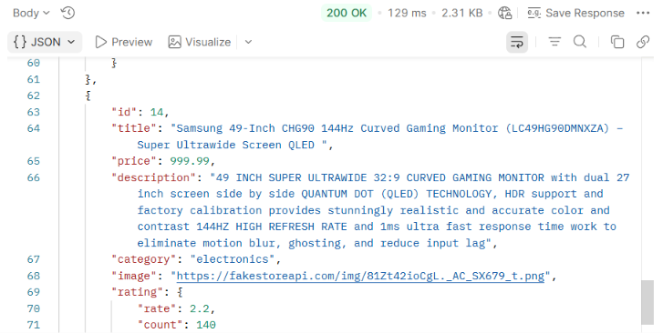
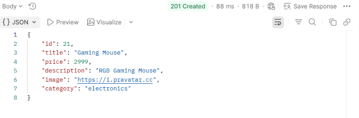
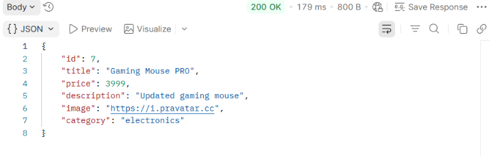
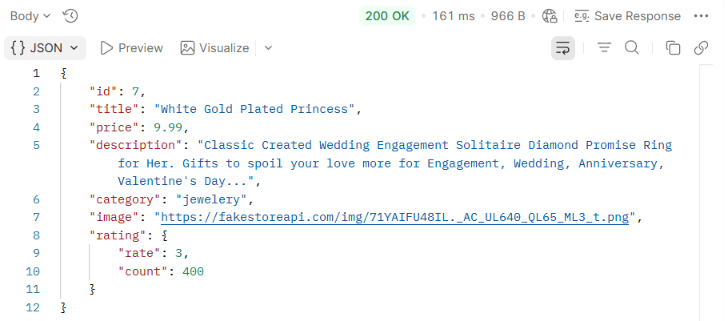

# Online Store REST API Documentation
## Общая информация

В проекте использован публичный REST API Fake Store API, предназначенный для демонстрации работы интернет-магазина и тестирования HTTP-запросов.
Base URL:https://fakestoreapi.com

## 1. Get all products

Method: GET
Endpoint: /products

Описание:
Возвращает список всех товаров магазина.

Статус ответа: 200 OK

## 2. Get product by ID

Method: GET
Endpoint: /products/1

Описание:
Возвращает информацию о выбранном товаре.

Статус ответа: 200 OK

## 3. Get all categories

Method: GET
Endpoint: /products/categories

Описание:
Возвращает список категорий товаров.

Статус ответа: 200 OK

## 4. Get products by category

Method: GET
Endpoint: /products/category/electronics

Описание:
Возвращает товары выбранной категории.

Статус ответа: 200 OK

## 5. Create product

Method: POST
Endpoint: /products

Описание:
Создает новый товар.

Body:
{
  "title":"Gaming Mouse",
  "price":2999,
  "description":"RGB Gaming Mouse",
  "image":"https://i.pravatar.cc",
  "category":"electronics"
}

Статус ответа: 201 Created

## 6. Update product

Method: PUT
Endpoint: /products/7

Описание:
Обновляет существующий товар.

Body:
{
  "title":"Gaming Mouse PRO",
  "price":3999,
  "description":"Updated gaming mouse",
  "image":"https://i.pravatar.cc",
  "category":"electronics"
}

Статус ответа: 200 OK

## 7. Delete product

Method: DELETE
Endpoint: /products/7

Описание:
Удаляет товар.

Статус ответа: 200 OK

## Использованные HTTP-методы

GET - получение данных;
POST - создание новой записи;
PUT - обновление существующей записи;
DELETE - удаление записи.

## Использованные инструменты

- Postman
- REST API
- JSON
- HTTP

## Вывод

В ходе работы была создана коллекция запросов Postman для тестирования REST API интернет-магазина. Проверены основные CRUD-операции (Create, Read, Update, Delete), получены ответы сервера в формате JSON и изучены основные HTTP-методы.